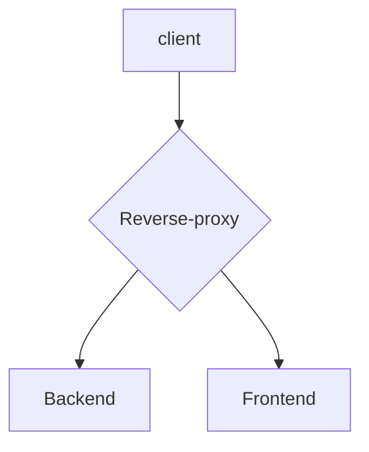

You've built your webapp.  Everything works in dev.  Your frontend talks to your backend and all the features are there.  It's time to deploy.  But .. how?  How does the front talk to the back in prod? Is it secure? Ports? What that CORS error?

It's a question I see pretty often.  And it makes sense that this doesn't get covered in schools/camps/tutorials.  There are so many correct answers and *YOUR* right answer depends on you process and infrastructure.  But there's one tool to have in your back pocket that will give you tons of flexibility and give you the foundational knowledge for other tools: the **reverse proxy**.

# What is a reverse proxy?
At its foundational level, a reverse proxy takes in web requests that are ultimately bound for different pieces of software and sends them out appropriately.  It presents a facade to a client that 1 server handles all the requests while defering the real work to something else. 

## Why is this useful?
A reverse proxy can solve a myriad of problems.  It can help with load balancing, traffic shaping, blue/green deploys, authentication, and CORS issues.  For this post, we're going to focus on how it helps to make different software developed in different languages appear as a single piece of software.  To the client, it all hides behind the reverse proxy.





It's common for the frontend to be in something like javascript (maybe it's a react frontend) and the backend to be in golang, java, or python.  It's also common that these components are developed by different teams and have different release tooling.  

## Is this necessary?
No, but it is helpful. Javascript frontends are usually served from static files.  Most dynamic backends (or web api servers) are quite capable of serving static content. See https://www.baeldung.com/spring-mvc-static-resources for java. https://expressjs.com/en/starter/static-files.html for node/express. https://www.alexedwards.net/blog/serving-static-sites-with-go for go.  But do you want to have a bugfix to your react require a build/deploy of your backend to release?  Maybe even an image rebuild?  Of course not.  While not the only reason, it's a big motivator to split static/frontend content out from the backend.  More advanced setups may split the static content out to a CDN.  Serving through a reverse proxy can be a useful intermediate step. Now that we have the background, let's look at some code.

# Configure NGINX
NGINX started as an http server alternative to apache, but its modular nature has made it an http swiss army knife.  Configuration into a reverse proxy can be fairly simple:
```{numberLines: true}
server {
  listen 80;

  # reverse proxy
  location /static {
    proxy_pass http://192.168.1.56:8082/; 
  }

  location /api/v1 {
    proxy_pass http://192.168.1.56:8081/; 
  }
}
```

In this configuration, we tell NGINX to listen on port 80.  If a request for anything under /static comes in, ask the server at 192.168.1.56 on port 8082 for content.  If the request is for anything under /api/v1, ask 192.168.1.56 on port 8081.  To the web browser (or Postman and other clients), there appears to only be 1 application listening on port 80.  That's great - the client gets a really simple view and we don't need to worry about things like CORS headers.  

What language/framework actually serves requests to those ports?  It doesn't matter.  We've added a layer of indirection so that the services aren't coupled together.  You see this pattern a lot in API Gateways, Kubernets Ingresses and cloud loadbalancers. It's called "path-based routing" and you can see some example documentation for configuring this in the cloud at https://cloud.google.com/load-balancing/docs/url-map 

# Configure Envoy
Envoy is a newer entrant specifically designed to be a proxy.  It underpins the service mesh tool Istio, coming out of Lyft to be a Kubernetes-native tool.  Being a for-developers, by developers tool, it is quite a bit less friendly to configure.  You might get the sense that it's yaml maps stright into the datastructures used to configure it.  The benefit is that once you get the hang of it, automating it (and indeed, dynamically configuring it) is easy.  You already know the datastructures.  Though out of scope for this post, https://www.envoyproxy.io/docs/envoy/latest/configuration/overview/examples has examples of configuring routes dynamically (which might be useful if you spin up ephemeral environments for development or test).  Back to the "basic" config equivalent to the nginx config above:

```{numberLines: true}
static_resources:
  listeners:
  - address:
      socket_address:
        address: 0.0.0.0
        port_value: 8080
    filter_chains:
    - filters:
      - name: envoy.filters.network.http_connection_manager
        typed_config:
          "@type": type.googleapis.com/envoy.extensions.filters.network.http_connection_manager.v3.HttpConnectionManager
          codec_type: AUTO
          stat_prefix: ingress_http
          route_config:
            name: local_route
            virtual_hosts:
            - name: backend
              domains:
              - "*"
              routes:
              - match:
                  prefix: "/static"
                route:
                  cluster: service1
              - match:
                  prefix: "/api/v1"
                route:
                  cluster: service2
          http_filters:
          - name: envoy.filters.http.router
  clusters:
  - name: service1
    type: STRICT_DNS
    lb_policy: ROUND_ROBIN
    load_assignment:
      cluster_name: service1
      endpoints:
      - lb_endpoints:
        - endpoint:
            address:
              socket_address:
                address: 192.168.1.56
                port_value: 8081
  - name: service2
    type: STRICT_DNS
    lb_policy: ROUND_ROBIN
    load_assignment:
      cluster_name: service2
      endpoints:
      - lb_endpoints:
        - endpoint:
            address:
              socket_address:
                address: 192.168.1.56
                port_value: 8082
admin:
  address:
    socket_address:
      address: 0.0.0.0
      port_value: 8001
layered_runtime:
  layers:
  - name: static_layer_0
    static_layer:
      envoy:
        resource_limits:
          listener:
            example_listener_name:
              connection_limit: 10000
```

Obviously, there's quite a bit more there.   The listeners section defines how Envoy will listen, and how path prefixes will be routed to other servers.  The clusters section defines how those servers are configured.  It's here that it becomes obvious that envoy is intended to be used in large, complex system.  Backends are often sets of servers, not just one process.  Often several of these mapping exist in one envoy instance (and several envoy instances run with similar configurations to handle and balance load).  As a fun bonus, this envoy config also limits concurrent connections to 10,000.  

# Want more?  Want to chat?

Want to talk more?  Find me on Wyzant!  If you're new to the platform, you get a $40 credit. 

https://www.wyzant.com/refer/tutor/88533966