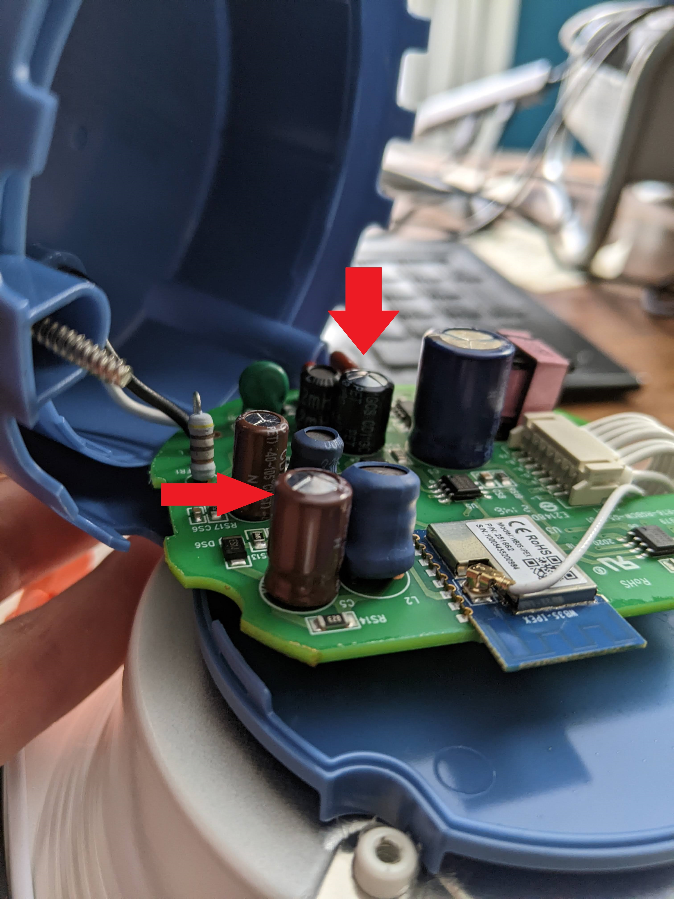

# Some non-user-serviceable parts... are. 
A couple of months ago, I bought a pack of Smartlights of a reputible brand.  They were easy to install, the app works great, and my wife and I can share control of some recessed cans (as well as standard bulbs).  Got a great deal, too! I found them on clearance at a big box store, then on super sale online.  Both slight indications they were about to be discontinued.  But they worked great, so I bought what I could.  Everything worked perfectly for 2 months, at which time one of the lights started to flicker, be at 1/2 power, then finally died.  

After a bit of convincing the seller that they did not, in fact, want this shipped back to restock, I figured it was time to oepn this up, since it was going to be e-waste anyway.

more text